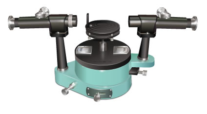

### Theory 

<iframe width="560" height="315" src="https://www.youtube.com/embed/jaOzC0leAdk" frameborder="0" allow="autoplay; encrypted-media" allowfullscreen></iframe>

When an atom or ion in a substance gets excited, they emit radiations of particular frequencies. These radiations are seen in the form of spectra. There are several types of spectra mainly,

<ul>
  <li><strong>Continuous spectra</strong> - continuous band of colors is obtained.</li>
  <li><strong>Absorption spectra</strong> - dark lines on a bright background.</li>
  <li><strong>Emission spectra</strong> - bright lines on dark background.</li>
</ul>

In this experiment a diffraction grating optical spectrometer is used to study the spectra.

The diffraction grating provides the simplest and most accurate method for measuring wavelengths of light. It consists of a very large number of equidistant narrow parallel rectangular slits of equal width separated by equal opaque portions. The ruled widths are opaque to light and space between any two successive lines is transparent and act as parallel slits. Number of rulings per cm of grating used in visible region varies from 5,000 to 12,000 lines per mm.

The slits of a grating give rise to diffraction and the diffracted light interferes so as to set up interference patterns. Complete constructive interference occurs when the phase or path difference is equal to some whole number of the wavelength. In general the grating equation for constructive maxima is,

$$\sin \theta = Nm \lambda$$

Where, m is called the order of the spectrum, λ the wavelength, N the number of lines per cm and θ the diffraction angle measured with respect to the direction of the light incident on the grating.

### Spectrometer apparatus

  

 

<strong>Spectrometer</strong> is an instrument which is used to measure the intensity and other properties of light. Direction of all rays should be same and for this, light which is to be analyzed must pass through the grating as a parallel beam.

<strong>The main parts of the spectrometer are:</strong>

<ul>
  <li>
    <strong>Collimator:</strong> The collimator is used to produce parallel rays. It consists of an adjustable slit and convex lens.
  </li>
  <li>
    <strong>Prism table:</strong> The prism table is circular in shape and is provided with three leveling screws. A central horizontal shelf is used for mounting either a prism or a grating.
  </li>
  <li>
    <strong>Vernier table:</strong> The Vernier table is also circular in shape and can be rotated about a vertical axis. Two verniers are attached to the Vernier table and they move along the circular scale when the Vernier table is rotated. The Vernier table, and hence the verniers, can be fixed in any position by means of a radial screw.
  </li>
  <li>
    <strong>Telescope:</strong> An objective lens that focuses on the entering parallel rays in a plane so that the real image can be observed with the aid of the eyepiece. Cross hairs are located in the focal plane of the objective lens. The telescope is attached to a circular scale and can be rotated about a vertical axis through the centre of the scale.
  </li>
</ul>

<h2>Preliminary Adjustments</h2>

<h4>Adjustment of Telescope</h4>

  The telescope is adjusted by looking at a distant object, until the object's cross wires are in sharp focus.

<h4>Adjustment of the Collimator</h4>

  The slit is opened slightly and is illuminated using the sodium lamp. The telescope is brought in line with the collimator. The image of the slit is observed through the telescope and is made to coincide with the vertical cross wire. The slit is made very narrow.

<h4>Adjustment of Prism Table</h4>

  The prism table is leveled using the spirit level or by the optical method. In the optical method, the leveling screws of the prism table are adjusted until the image of the slit is bisected by the horizontal cross wire.

  In this experiment, we are simulating the normal incidence position of the grating and performing further calculations. For details, please check the diffraction grating experiment in the optics lab.

