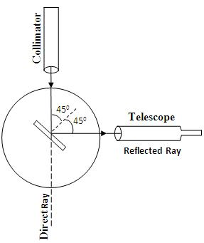
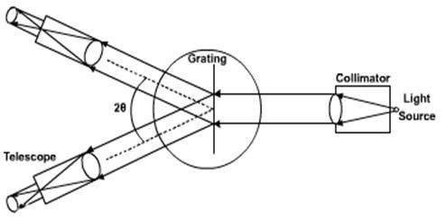
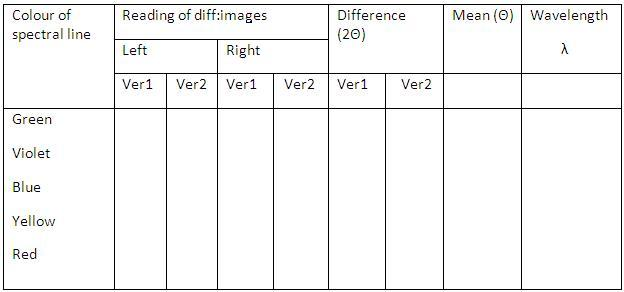

## Procedure

<h2>For Doing Simulation</h2>

<ol>
  <li>Move the slider in <strong>Calibrate Telescope</strong> and click the <strong>START</strong> button.</li>
  <li>Click on the combo box to select the lamp.</li>
  <li>Click <strong>Switch On Light</strong>.</li>
  <li>Set Vernier reading to 0° and telescope to 90° by adjusting both sliders.</li>
  <li>Click the <strong>Place Grating</strong> button.</li>
  <li>Turn the telescope to the left. Align the vertical cross wire with the green line on the pattern.</li>
  <li>Note the readings of Vernier 1 and Vernier 2.</li>
  <li>Move the telescope to the right side of the direct image and align the vertical cross wire with the green line on the pattern.</li>
  <li>Note the readings of Vernier 1 and Vernier 2 again.</li>
  <li>Use the slider under <strong>Fine Angle</strong> to get more precise readings.</li>
  <li>Calculate the difference between the two readings on the same Vernier.</li>
  <li>Take the mean value of this difference to get <strong>2θ</strong>, twice the angle of diffraction. From this, θ is obtained for the green line.</li>
  <li>Assuming the wavelength of the green line is 546 nm, calculate the number of lines per mm using the equation: 
    <strong>N = sinθ / (mλ)</strong> where <em>m</em> is the order.</li>
</ol>

<h2>For Doing the Real Lab</h2>

  

 

<h3>Setting the Grating for Normal Incidence Position</h3>

<ol>
  <li>Fix the Vernier table after making the preliminary adjustments.</li>
  <li>Illuminate the slit with a mercury vapour lamp and make the slit narrow.</li>
  <li>Bring the telescope in line with the collimator. Align the direct image of the slit with the vertical cross wire.</li>
  <li>Note down any one of the Vernier readings.</li>
  <li>Turn the telescope exactly through 90° and clamp it.</li>
  <li>Place the grating on the prism table with its ruled surface facing the collimator and perpendicular to the line joining the two leveling screws of the prism table.</li>
  <li>Unclamp the Vernier and rotate until the reflected image coincides with the vertical cross wire.</li>
  <li>Fix the prism table and note the Vernier readings.</li>
  <li>Unclamp the Vernier table and rotate exactly 45° in the proper direction so that the surface of the grating becomes normal to the collimator.</li>
  <li>Clamp the Vernier table.</li>
</ol>

<h3>Standardizing the Grating</h3>

  

 

<ol>
  <li>Move the telescope to observe the direct image. Diffraction patterns will be seen on either side of the direct image.</li>
  <li>Turn the telescope to the left and align the vertical cross wire with the green line on the pattern.</li>
  <li>Note the readings of Vernier 1 and Vernier 2.</li>
  <li>Move the telescope to the right side of the direct image and align the vertical cross wire with the green line on the pattern.</li>
  <li>Note the readings of Vernier 1 and Vernier 2 again.</li>
  <li>Calculate the difference between the two readings on the same Vernier.</li>
  <li>Take the mean value of this difference to get <strong>2θ</strong>. From this, calculate θ for the green line.</li>
  <li>Assuming the wavelength of the green line is 546 nm, calculate the number of lines per mm using the equation: 
    <strong>N = sinθ / (mλ)</strong>.</li>
</ol>

<h3>To Determine the Wavelength of Other Lines</h3>

Repeat the same procedure as above for other lines, and calculate their wavelengths using the equation:

λ = sinθ / (N × m)

 

## Results
 

The wavelength of the prominent lines of the mercury spectrum are given in nanometre in the tabular column.

 

Number of grating per metre=................/m

